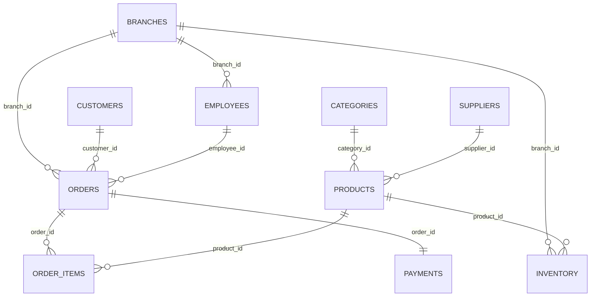

# 🛒 Retail Sales & Inventory Analytics System

<p align="center">
  
  
  
  
</p>

A **SQL-based Retail Sales & Inventory Analytics System** developed using **MySQL** to manage and analyze retail operations across multiple branches. The project focuses on analyzing **sales performance, customer behavior, product profitability, inventory health, employee productivity, and payment trends** to generate meaningful business insights.

---

## 📖 Project Overview

The **Retail Sales & Inventory Analytics System** is designed to simulate real-world retail management and analytics operations. The system helps analyze sales trends, identify high-value customers, optimize inventory levels, and evaluate branch and employee performance.

The project focuses on:

- Database Design
- Relational Database Management
- Sales & Revenue Analysis
- Customer Analytics
- Product & Category Performance
- Inventory Management
- Employee Performance Tracking
- Payment Analysis
- Branch-wise Reporting
- SQL Query Optimization
- Business Insights Generation

This project demonstrates practical SQL and database management skills using a real-world retail analytics scenario.

---

## 🚀 Features

### 📈 Sales Management
- Store customer orders across multiple branches
- Track order status (Delivered, Shipped, Pending, Cancelled, Returned)
- Maintain order line items with quantity, unit price, and discount
- Analyze revenue by branch, category, and product
- Compare monthly sales trends

### 👥 Customer Management
- Maintain customer details (name, email, phone, city, state)
- Track customer registration dates
- Analyze customer lifetime value
- Identify top-spending customers
- Perform cohort analysis by registration year

### 📦 Product & Category Management
- Store product details with unit price and cost price
- Organize products into categories
- Track profit margins per product
- Analyze product performance by quantity and revenue
- Identify slow-moving inventory

### 🏬 Inventory Management
- Maintain stock levels per product per branch
- Track last restock dates
- Identify low-stock products (below reorder level)
- Analyze branch-wise inventory value
- Detect products with zero sales in the last 6 months

### 🧑💼 Employee Management
- Maintain employee details and job roles
- Track employee salaries and joining dates
- Assign employees to branches
- Analyze employee sales performance
- Rank employees within each branch

### 🏢 Branch Management
- Store branch details (name, city, state, opening date)
- Analyze branch-wise revenue and order counts
- Compare performance across branches
- Identify top customers per branch

### 💳 Payment Management
- Track payment methods (Credit Card, Debit Card, UPI, Net Banking, Cash on Delivery, Wallet)
- Monitor payment status (Completed, Pending, Failed, Refunded)
- Analyze payment method distribution
- Calculate total amounts collected

### 🚚 Supplier Management
- Maintain supplier details
- Link products to suppliers
- Analyze supplier product counts
- Track supplier locations

---

## 🛠️ Technologies Used

| Technology | Description |
| :--- | :--- |
| **MySQL 8.0+** | Database Management System |
| **SQL** | Structured Query Language |
| **MySQL Workbench** | Database Modeling and Query Execution |
| **Git & GitHub** | Version Control |
| **Python** *(optional)* | Data Generation |

---

## 🗄️ Database Tables

The project contains **10 tables**:

| # | Table Name | Description | Rows |
| :--- | :--- | :--- | :--- |
| 1 | `categories` | Stores product category information | 10 |
| 2 | `suppliers` | Stores supplier details and contact information | 20 |
| 3 | `branches` | Stores branch information across cities | 10 |
| 4 | `customers` | Stores customer details and registration dates | 300 |
| 5 | `employees` | Stores employee details and job roles | 50 |
| 6 | `products` | Stores product details with pricing information | 100 |
| 7 | `orders` | Stores order header information | 800 |
| 8 | `order_items` | Stores order line items with quantity and discount | 2,000 |
| 9 | `payments` | Stores payment details for orders | 800 |
| 10 | `inventory` | Stores stock levels per product per branch | 910 |
| | | **Total Rows** | **5,000** |

---

## 🔗 Entity Relationship Diagram (ERD)



### 📌 Entity Relationship Highlights

- One **category** can contain multiple products.
- One **supplier** can supply multiple products.
- One **branch** can have multiple employees.
- One **branch** can process multiple orders.
- One **branch** can hold inventory for multiple products.
- One **customer** can place multiple orders.
- One **employee** can handle multiple orders.
- One **order** can contain multiple order items.
- One **order** has one payment.
- One **product** can appear in multiple order items.
- One **product** can be stocked in multiple branches through inventory.

---

## 🧠 SQL Concepts Used

The project demonstrates the following SQL concepts:

- DDL (Data Definition Language)
- DML (Data Manipulation Language)
- Constraints
- Primary Keys
- Foreign Keys
- Joins (INNER, LEFT)
- Aggregate Functions (`SUM`, `COUNT`, `AVG`, `ROUND`)
- `GROUP BY`
- `HAVING`
- `ORDER BY`
- Subqueries
- Multi-row Subqueries
- Correlated Subqueries
- CTEs (Common Table Expressions)
- Window Functions
- `RANK()`
- `DENSE_RANK()`
- `ROW_NUMBER()`
- `LAG()`
- `LEAD()`
- `CASE`
- Views
- Stored Procedures
- Triggers
- Indexing
- Partitioning

---

## 🔍 Sample Analytical Queries

### 1️⃣ Count Total Orders
```sql
SELECT COUNT(order_id) AS total_orders FROM orders;
```

### 2️⃣ Find Employees Earning More Than 50,000
```sql
SELECT * FROM employees WHERE salary > 50000;
```

### 3️⃣ List Products in Electronics Category
```sql
SELECT a.product_id, a.product_name, b.category_name
FROM products AS a
JOIN categories AS b ON a.category_id = b.category_id
WHERE b.category_name = 'Electronics';
```

### 4️⃣ List Distinct Payment Methods
```sql
SELECT DISTINCT payment_method FROM payments;
```

### 5️⃣ Calculate Revenue Per Order
```sql
SELECT order_id,
       SUM(quantity * unit_price - discount) AS total_revenue
FROM order_items
GROUP BY order_id
ORDER BY order_id;
```

### 6️⃣ Top 10 Best-Selling Products
```sql
SELECT b.product_id, b.product_name,
       SUM(a.quantity) AS total_quantity
FROM order_items AS a
JOIN products AS b ON a.product_id = b.product_id
GROUP BY b.product_id, b.product_name
ORDER BY total_quantity DESC
LIMIT 10;
```

### 7️⃣ Rank Customers by Total Spend
```sql
WITH customer_spend AS (
    SELECT c.customer_id, c.customer_name,
           SUM(oi.quantity * oi.unit_price - oi.discount) AS total_spend
    FROM customers c
    JOIN orders o       ON o.customer_id = c.customer_id
    JOIN order_items oi ON oi.order_id   = o.order_id
    GROUP BY c.customer_id, c.customer_name
)
SELECT customer_id, customer_name,
       ROUND(total_spend, 2) AS total_spend,
       RANK() OVER (ORDER BY total_spend DESC) AS spend_rank
FROM customer_spend
ORDER BY spend_rank;
```

### 8️⃣ Rank Employees Within Each Branch
```sql
WITH employee_sales AS (
    SELECT e.employee_id, e.employee_name, e.branch_id,
           SUM(oi.quantity * oi.unit_price - oi.discount) AS total_sales
    FROM employees e
    JOIN orders o       ON o.employee_id = e.employee_id
    JOIN order_items oi ON oi.order_id   = o.order_id
    GROUP BY e.employee_id, e.employee_name, e.branch_id
)
SELECT branch_id, employee_id, employee_name,
       ROUND(total_sales, 2) AS total_sales,
       RANK() OVER (PARTITION BY branch_id ORDER BY total_sales DESC) AS rank_in_branch
FROM employee_sales
ORDER BY branch_id, rank_in_branch;
```

### 9️⃣ Identify Slow-Moving Inventory
```sql
SET @max_date = (SELECT MAX(order_date) FROM orders);

SELECT p.product_id, p.product_name,
       SUM(i.stock_quantity) AS total_stock
FROM products p
JOIN inventory i ON i.product_id = p.product_id
WHERE NOT EXISTS (
    SELECT 1 FROM order_items oi
    JOIN orders o ON o.order_id = oi.order_id
    WHERE oi.product_id = p.product_id
      AND o.order_date >= DATE_SUB(@max_date, INTERVAL 6 MONTH)
      AND o.order_status IN ('Delivered','Shipped','Pending')
)
GROUP BY p.product_id, p.product_name
ORDER BY total_stock DESC;
```

### 🔟 Find Top Customer Per Branch
```sql
WITH branch_customer_spend AS (
    SELECT o.branch_id, c.customer_id, c.customer_name,
           SUM(oi.quantity * oi.unit_price - oi.discount) AS total_spend
    FROM orders o
    JOIN customers c    ON c.customer_id = o.customer_id
    JOIN order_items oi ON oi.order_id   = o.order_id
    GROUP BY o.branch_id, c.customer_id, c.customer_name
),
ranked AS (
    SELECT *,
           ROW_NUMBER() OVER (PARTITION BY branch_id ORDER BY total_spend DESC) AS rn
    FROM branch_customer_spend
)
SELECT r.branch_id, b.branch_name, r.customer_id, r.customer_name,
       ROUND(r.total_spend, 2) AS total_spend
FROM ranked r
JOIN branches b ON b.branch_id = r.branch_id
WHERE r.rn = 1
ORDER BY r.branch_id;
```

---

## 🎯 Project Objectives

- Analyze sales performance across branches and categories.
- Identify top-selling products and high-value customers.
- Track inventory levels and identify slow-moving stock.
- Evaluate employee productivity within each branch.
- Analyze payment method distribution and success rates.
- Perform cohort analysis by customer registration year.
- Calculate month-over-month revenue growth.
- Generate data-driven retail insights.
- Support better inventory and sales planning.

---

## 📚 Learning Outcomes

This project helped improve my knowledge of:

- Advanced SQL
- Database Design
- Relational Database Modeling
- Joins (INNER, LEFT)
- Subqueries (Scalar, Multi-row, Correlated)
- CTEs (Common Table Expressions)
- Window Functions (`RANK`, `DENSE_RANK`, `ROW_NUMBER`, `LAG`, `LEAD`)
- Views
- Stored Procedures
- Triggers
- Indexing
- Partitioning
- Query Optimization
- Data Analysis
- Real-world SQL Problem Solving

---

## 🔮 Future Enhancements

- Power BI Dashboard Integration
- Tableau Dashboard Integration
- Web Application Integration
- Real-time Sales Data Integration
- Interactive Retail Sales Dashboard
- Automated Low-Stock Alerts
- AI-Based Sales Forecasting
- Automated Reorder Recommendations
- Customer Segmentation & Retention Analysis
- Predictive Inventory Management

---

## 📁 Project Structure

```
Retail-Sales-Inventory-Analytics/
│
├── README.md
├── schema/
│   └── create_tables.sql
├── data/
│   ├── categories.csv
│   ├── suppliers.csv
│   ├── branches.csv
│   ├── customers.csv
│   ├── employees.csv
│   ├── products.csv
│   ├── orders.csv
│   ├── order_items.csv
│   ├── payments.csv
│   └── inventory.csv
├── queries/
│   ├── level1_basic.sql
│   ├── level2_intermediate.sql
│   └── level3_advanced.sql
└── docs/
    └── erd_diagram.png
```

---

## ⚙️ How to Run the Project

### Step 1: Install MySQL
Install:
- MySQL Server
- MySQL Workbench

### Step 2: Create Database
```sql
CREATE DATABASE retail_sales_analytics;
USE retail_sales_analytics;
```

### Step 3: Create Tables
Create the required 10 tables:
```
categories
suppliers
branches
customers
employees
products
orders
order_items
payments
inventory
```

### Step 4: Insert Data
Insert sample category, supplier, branch, customer, employee, product, order, order_item, payment, and inventory data.

**⚠️ Important:** Insert in this order to avoid foreign key errors:
1. categories
2. suppliers
3. branches
4. products
5. employees
6. customers
7. orders
8. order_items
9. payments
10. inventory

### Step 5: Execute Analytical Queries
Run SQL queries to analyze:
- Sales and revenue trends
- Top products and categories
- Customer lifetime value
- Employee performance
- Inventory levels and slow-movers
- Payment distribution
- Branch-wise performance
- Month-over-month growth

---

## 🏁 Project Conclusion

The **Retail Sales & Inventory Analytics System** is a MySQL-based retail analytics project that demonstrates practical knowledge of database design, relational data modeling, advanced SQL, and data analysis. The system combines sales, customer, product, inventory, employee, payment, and branch data to generate meaningful retail insights.

Through this project, SQL can be used not only to store retail data but also to **identify top-selling products, analyze customer behavior, track inventory health, evaluate employee performance, and support data-driven retail planning**.


<p align="center">
  ⭐ <b>If you found this project helpful, please give it a star!</b> ⭐
</p>
